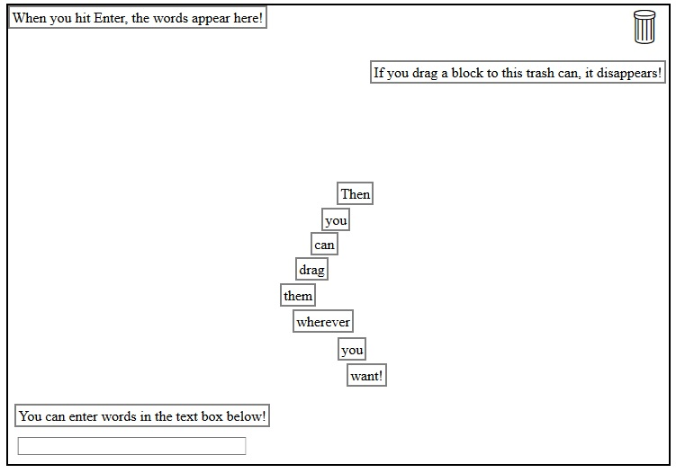

# Fridge Magnets

Deployed [here.](https://gkjcjg.github.io/fridge_magnets/)

A friend asked for an app that would allow him to enter words and phrases, have them appear in a sandbox where the could be mouse-dragged around, and drop them off in a trash bin when they were no longer needed. In response, I created this.

## How it works

The app consists of a text entry field, a sandbox, and a trashcan. When text is entered in the entry field, it can be moved into the sandbox with the press of the 'Enter' key. A block of text can be moved to the trashcan, which deletes the `
` that contains that text.

### Dragging multiple boxes

When the number of text boxes increases, it can be bothersome to move each box one by one. In order to move multiple boxes simultaneously, hold the Control key while clicking on each box to be moved. Release the control key, and drag anywhere in the green-bordered box to move all of the selected textboxes.

## To get it running

The app consists of a single HTML page with a style tag in the header and a short JS script at the end of the body. Simply open the html file in a browser or click the link above to get the app running.

## What I learned

To make this app, I had to look into the details of mouseup mousedown and mousemove events in JS. I also discovered that an HTML element does not inherit its CSS features as its own properties. That is, just because you put `.mover {left: 0}` in the CSS does not mean that `
` will have `.style.left = 0`. Element style and CSS style are strictly separate.
